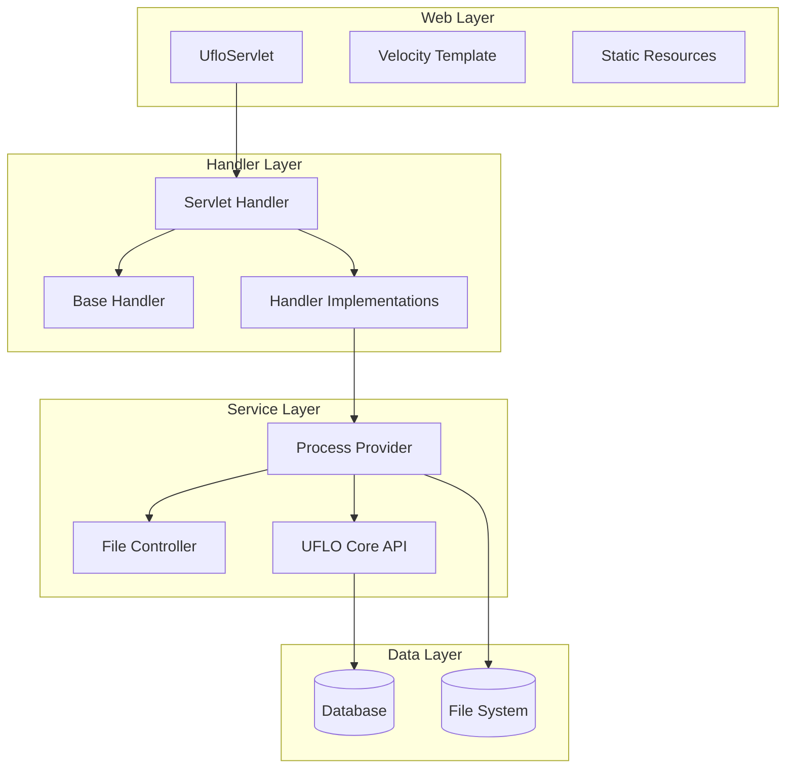

# UFLO Console 模块

UFLO Console 是 UFLO 工作流引擎的控制台模块，提供 Web 界面和 REST API 来管理和监控工作流系统。该模块基于 Servlet 技术构建，提供了流程定义、任务管理、流程监控等功能的 Web 界面。

## 概述

UFLO Console 模块提供：
- Web 管理界面，用于流程设计和管理
- REST API 接口，支持外部系统集成
- 流程部署和管理功能
- 任务管理和监控功能
- 流程图可视化展示
- 日历和调度管理

## 依赖关系

- **uflo-core**: 提供核心工作流引擎功能
- **Jakarta Servlet API**: 提供 Web 容器支持
- **Apache Velocity**: 模板引擎，用于页面渲染
- **Jackson**: JSON 处理库
- **Spring Boot**: 提供自动配置支持
- **Apache Commons FileUpload**: 文件上传处理

## 包结构

### 1. com.bstek.uflo.console
- `UfloServlet`: 主要的 Servlet 入口，处理所有控制台请求

### 2. com.bstek.uflo.console.config
- `UfloConsoleAutoConfiguration`: 控制台模块的自动配置类
- `UfloConsoleConfiguration`: 控制台模块的配置类

### 3. com.bstek.uflo.console.handler
- `ServletHandler`: Servlet 处理器接口
- `BaseServletHandler`: Servlet 处理器基类
- `impl` - 具体处理器实现

### 4. com.bstek.uflo.console.provider
- `ProcessProvider`: 流程提供者接口，用于管理流程定义文件
- `DefaultFileProcessProvider`: 默认文件流程提供者实现
- `ProcessFile`: 流程文件实体
- `ProcessProviderUtils`: 流程提供者工具类

## 核心组件

### UfloServlet
控制台的主要入口 Servlet，负责：
- 接收和分发所有 Web 请求
- 路由到相应的处理器
- 统一处理请求和响应

### ServletHandler 体系
采用处理器模式，支持多种功能模块：
- 实现功能模块的解耦
- 支持请求的统一处理
- 便于功能扩展

### ProcessProvider 体系
流程定义的管理接口：
- 支持不同存储策略
- 提供流程定义的增删改查
- 支持流程文件的加载和保存

## 功能模块

### 1. 流程设计 (designer)
- 流程定义的图形化设计
- BPMN 元素的可视化编辑
- 流程验证和保存

### 2. 流程部署 (deploy)
- 流程定义文件的上传和部署
- 版本管理和发布
- 流程激活和挂起

### 3. 任务管理 (todo)
- 个人任务列表
- 任务签收和完成
- 任务转办和委托

### 4. 流程监控 (list)
- 运行中流程实例监控
- 历史流程查询
- 流程执行统计

### 5. 流程图 (diagram)
- 流程执行状态可视化
- 当前节点高亮显示
- 流程路径追踪

### 6. 调度管理 (central)
- 定时任务管理
- 流程调度配置
- 任务提醒设置

### 7. 日历管理 (calendar)
- 工作日历定义
- 节假日配置
- 业务时间计算

### 8. 资源管理 (res)
- 静态资源配置
- 样式和脚本管理
- 资源访问控制

## 架构设计

## REST API 结构

### 基础路径
- `/uflo/`: 所有控制台 API 的基础路径

### 主要端点
- `/uflo/deploy`: 流程部署相关操作
- `/uflo/task`: 任务管理相关操作
- `/uflo/process`: 流程管理相关操作
- `/uflo/history`: 历史数据相关操作
- `/uflo/diagram`: 流程图相关操作
- `/uflo/calendar`: 日历管理相关操作

## 扩展机制

### 自定义处理器
- 可通过实现 ServletHandler 接口扩展功能
- 支持自定义请求处理逻辑
- 便于集成特定业务需求

### 流程提供者
- 可通过实现 ProcessProvider 接口扩展存储方式
- 支持数据库、文件系统等多种存储方式
- 便于集成外部存储系统

## 配置

### 自动配置
- 通过 Spring Boot 自动配置
- 简化部署和集成过程
- 支持外部化配置

### 属性配置
- 支持 application.properties/yml 配置
- 可自定义控制台访问路径
- 可配置资源路径和访问权限

## 安全性

- 基于角色的访问控制
- 支持身份认证集成
- 防止 CSRF 和 XSS 攻击
- 敏感数据加密传输

## 部署方式

### Web 容器部署
- 支持标准 Servlet 容器
- 可作为 WAR 包部署
- 与 Spring Boot 应用集成

### 独立运行
- 可作为独立应用运行
- 支持嵌入式 Web 服务器
- 便于开发和测试

## 集成方式

### 与业务系统集成
- 通过 REST API 调用
- 嵌入业务系统的界面
- 共享用户认证系统

### 与 UFLO Core 集成
- 依赖 uflo-core 模块
- 共享数据存储
- 统一的事务管理