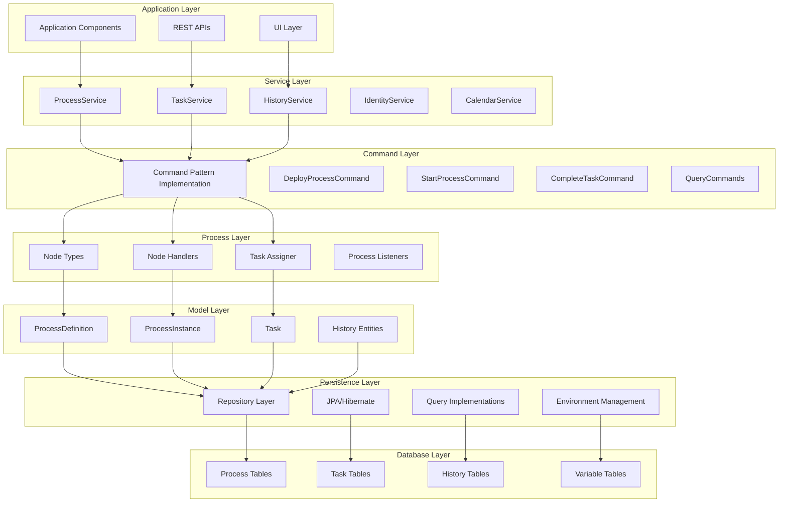
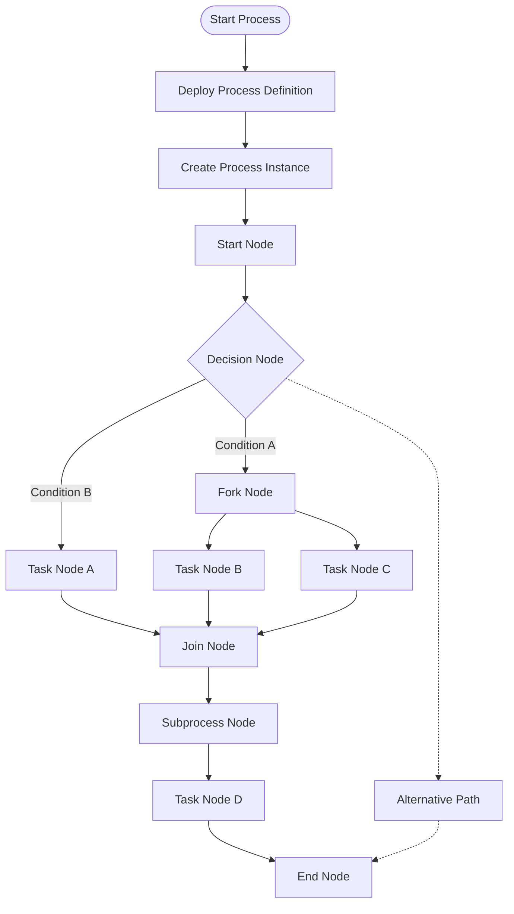
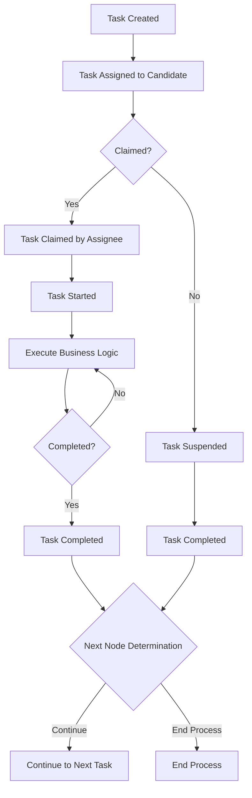

# UFLO Core 模块

UFLO Core 是 UFLO 工作流引擎的核心模块，提供整个工作流系统的基础设施和核心功能。

## 概述

UFLO Core 模块提供了工作流引擎的基础架构，包括：
- 流程定义与实例管理
- 任务管理与调度
- 数据持久化与查询
- 表达式解析
- 流程部署
- 环境配置
- 模型定义
- 历史记录管理

## 架构设计

UFLO Core 模块采用分层架构设计，主要分为以下几个层次：

1. **命令层 (com.bstek.uflo.command)**：提供统一的命令模式，用于执行各种工作流操作
2. **配置层 (com.bstek.uflo.config)**：提供模块的自动配置和属性设置
3. **部署层 (com.bstek.uflo.deploy)**：负责流程定义的部署和解析
4. **表达式层 (com.bstek.uflo.expr)**：提供表达式解析和计算功能
5. **环境层 (com.bstek.uflo.env)**：管理工作流运行时环境
6. **模型层 (com.bstek.uflo.model)**：定义工作流核心数据模型
7. **流程层 (com.bstek.uflo.process)**：包含流程节点、连接、分配器等核心流程元素
8. **查询层 (com.bstek.uflo.query)**：提供流程和任务的查询功能
9. **服务层 (com.bstek.uflo.service)**：提供高层业务服务接口
10. **工具层 (com.bstek.uflo.utils)**：提供通用工具函数
11. **心跳层 (com.bstek.uflo.heartbeat)**：维护工作流实例的心跳检测
12. **图表层 (com.bstek.uflo.diagram)**：提供流程图生成功能
13. **仓库层 (com.bstek.uflo.repository)**：提供数据访问层封装

## 系统架构图

## 流程执行流程图

## 任务处理流程图

## 技术栈

- **Spring Framework**: 提供依赖注入、事务管理等功能
- **Hibernate**: ORM 框架，用于数据持久化
- **Quartz**: 任务调度框架
- **Jackson**: JSON 序列化/反序列化
- **JEXL**: 表达式语言解析
- **DOM4J**: XML 解析
- **Commons**: 各种通用工具库

## 核心功能

### 1. 流程管理
- 流程定义的部署、激活、挂起、删除
- 流程实例的启动、挂起、激活、删除
- 流程实例变量的设置和查询

### 2. 任务管理
- 任务的创建、分配、签收、完成
- 任务的批量操作
- 任务优先级、进度管理
- 任务转办、撤回、回退

### 3. 查询功能
- 流程定义查询
- 流程实例查询
- 任务查询
- 历史数据查询

### 4. 部署机制
- XML/BPMN 流程定义文件的解析和部署
- 流程验证机制

### 5. 历史记录
- 流程执行历史记录
- 任务历史记录
- 变量历史记录

## 扩展机制

UFLO Core 提供了丰富的扩展点，允许用户自定义：

1. **任务分配器**：自定义任务分配规则
2. **表达式解析器**：扩展表达式功能
3. **事件监听器**：监控流程执行过程
4. **安全策略**：自定义安全控制逻辑

## 设计原则

1. **可扩展性**：通过接口和扩展点提供灵活的扩展机制
2. **高性能**：采用缓存、批处理等技术优化性能
3. **易用性**：提供简洁的 API 和配置方式
4. **可靠性**：支持事务、错误处理等机制确保系统稳定

## 模块依赖

- **Spring Boot**: 提供自动配置和启动支持
- **Spring Data JPA**: 简化数据访问层实现
- **Hibernate**: 提供强大的 ORM 功能